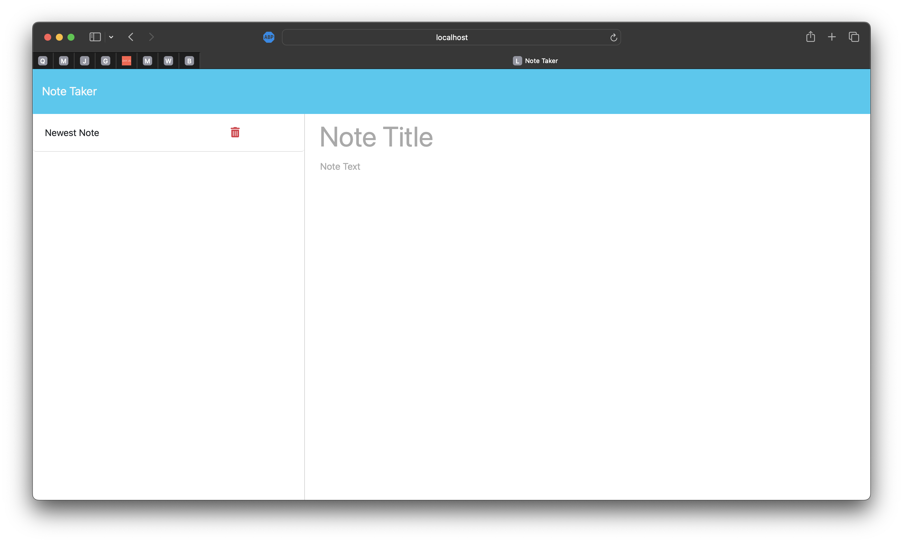

# NOTE-TAKER_EXPRESS

## License

[](https://opensource.org/licenses/MIT)

## User Story
```md
AS A small business owner
I WANT to be able to write and save notes
SO THAT I can organize my thoughts and keep track of tasks I need to complete
```

## Description:
A note taking application that can write and store notes to help the user improve productivity and avoid incompleting daily tasks.

## Table of Contents:

- [License](#License)
- [User Story](#User-Story)
- [Description](#Description)
- [Acceptance Criteria](#Acceptance-Criteria)
- [Screenshots](#Screenshots)
- [Installation](#Installation)
- [Running Application](#running-application)
- [Author](#Author)


## Acceptance Criteria
```md
GIVEN a note-taking application
WHEN I open the Note Taker
THEN I am presented with a landing page with a link to a notes page
WHEN I click on the link to the notes page
THEN I am presented with a page with existing notes listed in the left-hand column, plus empty fields to enter a new note title and the note’s text in the right-hand column
WHEN I enter a new note title and the note’s text
THEN a "Save Note" button and a "Clear Form" button appear in the navigation at the top of the page
WHEN I click on the Save button
THEN the new note I have entered is saved and appears in the left-hand column with the other existing notes and the buttons in the navigation disappear
WHEN I click on an existing note in the list in the left-hand column
THEN that note appears in the right-hand column and a "New Note" button appears in the navigation
WHEN I click on the "New Note" button in the navigation at the top of the page
THEN I am presented with empty fields to enter a new note title and the note’s text in the right-hand column and the button disappears
```

## Screenshots:

### Displaying Application Homepage

### Adding New Note 

### Deleting Note



## Installation:
```md
No installation necessary. Simply visit the application's deployed link [here] (https://notetaker-exp-58897a6da757.herokuapp.com/)
```

## Running Application
```md
1. Run the application by visiting the deployed link.
2. User will be greeted with a landing page briefly describing the apps functionality.  User click "Start".
3. In following fields users can write and save notes by writing in the "Note Title" and "Note Text" fields, then pressing "save".
4. To delete notes, simply click on the red trash icon next to your saved notes. 
```

## Author

Follow me on Github at [Utero93](https://github.com/Utero93) Additional questions or concerns? feel free to contact me at angel.m.gonzalez193@gmail.com. 